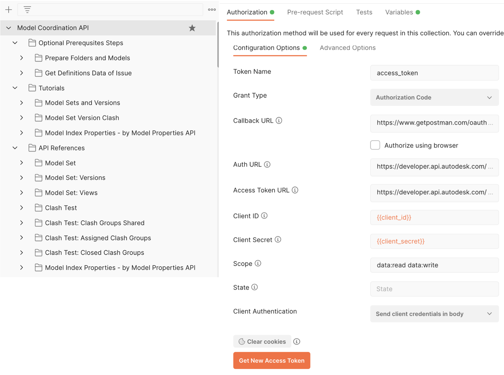

# Postman Collection for Model Coordination API 

[](https://www.getpostman.com/)

[](https://forge.autodesk.com/en/docs/acc/v1/overview/field-guide/model-properties)

[](https://forge.autodesk.com/en/docs/acc/v1/overview/field-guide/model-properties)


[](http://opensource.org/licenses/MIT)


## Description

This repository provides a postman collection that follows [tutorials](https://forge.autodesk.com/en/docs/bim360/v1/tutorials/model-coordination/mc-tutorial-model-set/) and [API references](https://forge.autodesk.com/en/docs/bim360/v1/reference/http/mc-modelset-service-v3-create-model-set-POST/) for Model Coordination API on Forge developer portal. This API works with BIM360 and Autodesk Construction Cloud (ACC). 

 The API supports **3 legged token** only.

 Update:
 The [Index v1 API of Model Coordination API](https://forge.autodesk.com/en/docs/bim360/v1/reference/http/mc-index-service-v1-query-model-set-version-index-manifest-GET/) is now deprecated. To get index of the models of Model Coordination, use [Model Properties API](https://forge.autodesk.com/en/docs/bim360/v1/reference/http/mc-index-service-v1-query-model-set-version-index-manifest-GET/). The collection in this repository provides some demo endpoints. To learn more details of **Model Properties API**, check [the other Postman collection](https://github.com/Autodesk-Forge/forge-model.properties-postman.collection). 


## What's Postman?

Postman is a popular tool that provides an easy-to-use interface to send HTTP requests. Postman is able to parse the responses that Forge sends you and save response parameter values to variables. These parameters can then be reused in subsequent requests through these variables. The Postman collections in this repository use this ability to provide pre-populated HTTP requests to help you follow the tutorial workflow with minimal effort. You can also modify the requests and experiment without having to write a single line of code. 

- You can learn how to install and use Postman from [here](https://learning.getpostman.com/docs/postman/launching_postman/installation_and_updates).

- You can download the Postman installer from [here](https://www.getpostman.com/downloads/).

## Setup

1.  **Forge Account**: Learn how to create a Forge Account, activate the subscription and create an app by [this tutorial](http://learnforge.autodesk.io/#/account/). Get Forge _client id_, _client secret_ and  _callback url_. Please register Forge app with the _callback url_ as 

    ```https://www.getpostman.com/oauth2/callback```

2. **BIM 360 (or ACC) Account and project**: must be Account Admin to add the app integration. [Learn about provisioning](https://forge.autodesk.com/blog/bim-360-docs-provisioning-forge-apps). Make a note with the __account name__

3. Upload some demo models to one folde of **Project Files** in BIM360, or folder of ***Files** in ACC. Some sample models are available at [Revit models](https://github.com/xiaodongliang/Demo-Test-Sample-Files/tree/master/Model%20Coordination%20API). 

4. Get BIM 360/ACC Docs project id (without b.) by API , or copy from browser URL bar of Docs UI. And get the folder id.

5.  Clone this repository or download it. It's recommended to install [GitHub Desktop](https://desktop.github.com/). To clone it via command line, use the following (**Terminal** on MacOSX/Linux, **Git Shell** on Windows):

    ```git clone https://github.com/xiaodongliang/forge-model.coordination.api-postman.collection```

6. Import the collection and environment files to Postman

7. In environment, input _client id_, _client secret_

   <p align="center"></p>  

8. In context menu of collection >> **Edit**, switch to the tab **Authorization**. Click **Get New Access Token**, input the variables as below:

   - Grant Type ``Authorization Code``com/
   - Callback URL  ``https://www.getpostman.oauth2/callback``
   - Auth URL  ``https://developer.api.autodesk.com/authentication/v1/authorize``
   - Access Token URL  ``https://developer.api.autodesk.com/authentication/v1/gettoken``

   - Client ID ``{{client_id}}``
   - Client Secret ``{{client_secret}}``
   - Scope ``data:readx``
   - Client Authentication ``Send Client credentials body``

   <p align="center"></p> 
 
 9. Click **Get New Access Token**, it will direct to login Autodesk account, after it succeeds, the token will be generated. Click **Use Token**.  
   
   Model Properties API requires to work with 3-legged token. This collection takes **[Inheriting auth](https://learning.getpostman.com/docs/postman/sending-api-requests/authorization/#inheriting-auth)** to apply 3-legged token to every endpoint in the collection automatically, which means it does not need to input the token in the header explicitly.

## API Test

1. Assume the steps of **Setup** have been performed and the access token is ready.

2. If you want to test the existing project and folder of model coordination space (which contains some demo models already), in environment variable, input the project id (without b) for mc_container_id and folder urn for mc_folder_id.  


   Or, you can perform the steps to create new folder, upload models by Optional Prerequsites Steps>>Prepare Folders and Models. Firstly input the account_name and project_name. Run the scripts one by one, including uploading the demo models to the new folder. 

3. When the model coordination space (with models) is ready. Play the tutorials or API references. Try to change some parameters or body for more scenarios to test. 
   <p align="center"></p>  

4. To test the endpoint of creating [clash issue](https://forge.autodesk.com/en/docs/bim360/v1/reference/http/mc-modelset-service-v3-add-model-set-issue-POST/), it requires _issue type id_, _issue root cause id_, _one user id_. Please perform the steps by Optional Prerequsites Steps>>Get Definitions Data of Issue. Note: The endpoints to get issue type and root cause of Issue API of BIM360 and ACC are seperate. 


## Tutorials
1. **Model Sets and Versions**: this demos how to create a new model set (new model coordination space), how to get model sets and query model set versions. It also provides demo when you want to enable an deactivated modelset. When a new model set is created or is enabled, a job will start. Check its status by _GET ModelSet Job Status_. The pre-defined variables are: _mc container id_ (project id without b.) and _mc folder id_ (the folder urn of the model coordination space).

2. **Model Set Version Clash**: this demos how to get clash data of one clash test.The pre-defined variables are: _mc container id_ (project id without b.) and _modelSetId_ (one model set id from previous scripts).

3. **Model Index Properties** - by Model Properties API: this demos how to get document properties(indexing) by Model Properties API with one query condition (views cound>0). The pre-defined variables are: _first model version urn_ and _second model version urn_. Check [the other Postman collection](https://github.com/Autodesk-Forge/forge-model.properties-postman.collection) for more guide about Model Properties API.

## API References
  This sections follows the same as [API document](https://forge.autodesk.com/en/docs/bim360/v1/reference/http/mc-modelset-service-v3-create-model-set-POST/). 

1. **Model Set**: the endpoints to create model set, get model set, create clash issue, enable/disable model set etc.
2. **Model Set: Versions**: the endpoints to create or get model set version
3. **Model Set: Views** : the endpoints to get model set views, the documents with the views etc.
4. **Clash Test**: endpoints to get clash test and clash result.
5. **Clash Test: Clash Groups Shared**, **Clash Test: Assigned Clash Groups**, **Clash Test: Closed Clash Groups**: endpoints related with clash groups
6. **Model Index Properties**: endpoints to get indexing properties by Model Properties API


## Further Materials

- [Model Coordination API Reference](https://forge.autodesk.com/en/docs/bim360/v1/reference/http/mc-modelset-service-v3-create-model-set-POST/)
- [Model Coordination API Tutorials](https://forge.autodesk.com/en/docs/bim360/v1/tutorials/model-coordination/mc-tutorial-model-set/)
- [Model Properties API Reference](https://forge.autodesk.com/en/docs/acc/v1/reference/http/index-v2-index-jobs-batch-status-post/)
- [Querying Model Properties](https://forge.autodesk.com/en/docs/acc/v1/tutorials/model-properties/query)
 

**Blogs**:
- [Forge Blog](https://forge.autodesk.com)
- [Field of View](https://fieldofviewblog.wordpress.com/), a BIM focused blog

## License

This sample is licensed under the terms of the [MIT License](http://opensource.org/licenses/MIT). Please see the [LICENSE](LICENSE) file for full details.

## Written by

Xiaodong Liang [@coldwood](https://twitter.com/coldwood), [Developer Advacate and Support team](http://forge.autodesk.com)